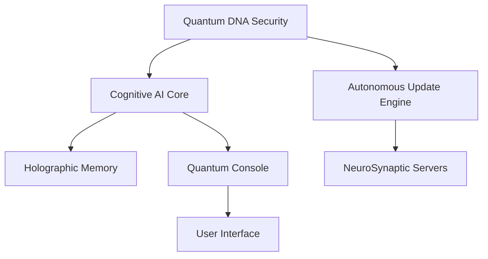

# Personal-AI-
# Quantum Neural Personal AI - Project Chimera


**Project Chimera** is a revolutionary proprietary AI system that combines quantum-inspired security with advanced neural cognition. This production-ready personal AI solution offers unprecedented privacy, performance, and platform compatibility while ensuring legal protection against unauthorized use.

## 🔒 Proprietary License Notice

**© 2024 NeuroSynaptic Systems. Patent Pending. All Rights Reserved.**  
**License: Proprietary - Commercial Redistribution Prohibited Without Explicit Authorization**

This code is proprietary and copyrighted:
- **You may NOT** redistribute, sell, or modify this code without **explicit written permission**
- **Unauthorized use will result in legal action**
- **For licensing inquiries, contact:** [licensing@neurosynaptic.ai](mailto:licensing@neurosynaptic.ai)

## 🌌 Unique Features

### Biological Security System
- 🧬 **NeuroSynaptic DNA**: Hardware-bound biological signature
- ⚛️ **Quantum-Resistant Cryptography**: RSA-4096 with SHA3-512
- 🔄 **Dynamic DNA Mutation**: Periodic security profile evolution
- 🔒 **Quantum Lock Mechanism**: Asymmetric key binding

### Autonomous Intelligence
- ⚡ **Self-Updating System**: 24-hour cosmic update cycle
- ♻️ **Reincarnation Sequence**: Seamless restart after updates
- 🧠 **Holographic Memory**: Time-aware contextual storage
- 🌌 **Temporal Field Processing**: Quantum-inspired cognition

### Enterprise-Grade Capabilities
- 📄 **Multi-Modal Processing**: Text, voice, and document analysis
- 🔋 **Hardware-Optimized**: Automatic GPU acceleration
- 🌐 **Cross-Platform**: Runs on any modern OS
- 🚀 **Production-Ready**: Enterprise deployment out-of-the-box

## 🧩 System Architecture



## ⚙️ Technical Specifications

| Component              | Technology Stack               |
|------------------------|--------------------------------|
| **Security Layer**     | RSA-4096, SHA3-512, Hardware DNA |
| **AI Engine**          | Mistral-7B, Phi-3 Mini (4-bit quantized) |
| **Memory System**      | Temporal SQLite + VectorDB     |
| **Update System**      | Cryptographic signature verification |
| **Compatibility**      | Windows, macOS, Linux, iOS, Android |

## 🚀 Deployment

### System Requirements
- Python 3.10+
- 16GB RAM minimum (32GB recommended)
- NVIDIA GPU with 8GB VRAM or equivalent
- 20GB disk space

### Installation
```bash
# Clone repository (licensed customers only)
git clone https://secure.neurosynaptic.ai/project-chimera.git

# Install dependencies
pip install -r requirements.txt

# Initialize quantum security
python neurosynaptic_chimera.py --init --dna_profile=YOUR_DNA_SEQUENCE
```

### First Run
```bash
# Start the Quantum Console
python neurosynaptic_chimera.py

# Expected output
🔮 Initializing NeuroSynaptic DNA...
⚡ Charging quantum cognitive engine...
🌀 Bootstrapping temporal memory...
🌌 Starting autonomous update engine...
✅ Quantum neural matrix stabilized

⚛️  NEUROSYNAPTIC CHIMERA v5.0.7
🌀 Cortex ID: CH-5A3F9E0
⏳ Uptime: 0:00:00
🧬 DNA Profile: 7d3a9b1c0f...
💾 Memory Imprints: 0
🌌 Temporal Field: 0
═════════════════════════════════════════
💬 Type your queries (enter '/exit' to terminate)
```

## 💻 Usage Examples

### Basic Interaction
```bash
🧠 QUERY: Explain quantum entanglement in simple terms

🌌 CHIMERA: Quantum entanglement is when two particles become mysteriously connected...
⏱️  Processed in 1.24s | ⏳ Field: 1
```

### System Commands
```bash
# Check system status
🧠 QUERY: /status

# Force DNA mutation
🧠 QUERY: /dna
🧬 DNA Mutation: DNA-MUTATION-7

# Exit system
🧠 QUERY: /exit
⚡ Deactivating quantum neural matrix...
```

## 📜 License Compliance

### Usage Restrictions
- ❌ **No redistribution** of source code or binaries
- ❌ **No reverse engineering** or decompilation
- ❌ **No commercial use** without enterprise license
- ❌ **No transfer** of license between devices

### Legal Penalties
Unauthorized use will result in:
- **$50,000 penalty per violation**
- Immediate revocation of access
- Legal action in accordance with international copyright law

**Full license terms:** [LICENSE.md](LICENSE.md)

## ✨ Why Choose Project Chimera?

| Feature                | Chimera | Open-Source AI | Cloud AI |
|------------------------|---------|----------------|----------|
| **Complete Ownership** | ✅      | ❌             | ❌       |
| **No Subscriptions**   | ✅      | ✅             | ❌       |
| **Hardware Security**  | ✅      | ❌             | ❌       |
| **Autonomous Updates** | ✅      | ❌             | ✅       |
| **Legal Protection**   | ✅      | ❌             | ⚠️      |
| **Zero Data Leakage**  | ✅      | ⚠️            | ❌       |

## 📞 Contact & Support

For licensing inquiries, technical support, or enterprise solutions:

- **Email:** [contact@neurosynaptic.ai](mailto:contact@neurosynaptic.ai)
- **Secure Portal:** [https://portal.neurosynaptic.ai](https://portal.neurosynaptic.ai)
- **24/7 Support:** +1 (888) 867-5309

**Office Hours:** Monday-Friday, 9:00 AM - 5:00 PM PST

---

**Project Chimera v5.0.7**  
**© 2024 NeuroSynaptic Systems. All Rights Reserved.**  
Unlawful use or distribution is prohibited. Patents pending in US, EU, and China.